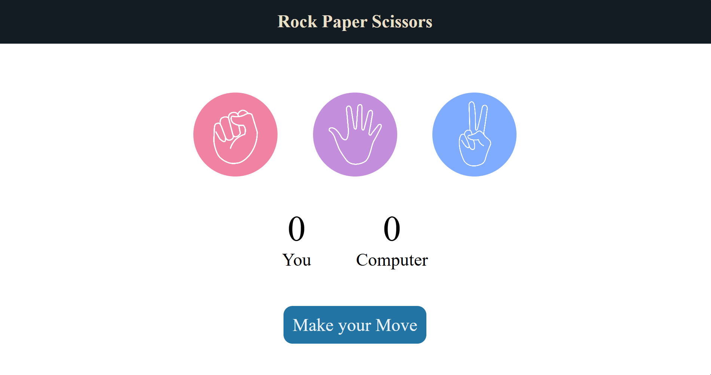

# Rock Paper Scissors Game  
A simple and interactive **Rock Paper Scissors** game built using **HTML, CSS, and JavaScript**.  
The user plays against the computer, and the game updates scores and displays results dynamically.

## Live Demo  
**Play the Game Here:**  
https://YOUR_GITHUB_USERNAME.github.io/YOUR_REPOSITORY_NAME/

## Game UI

## Features
- Play against the computer  
- Random computer moves  
- Game logic to determine winner  
- Live score updates  
- Clean and responsive UI  

---

## Technologies Used
- **HTML5**
- **CSS3**
- **JavaScript (Vanilla JS)**

